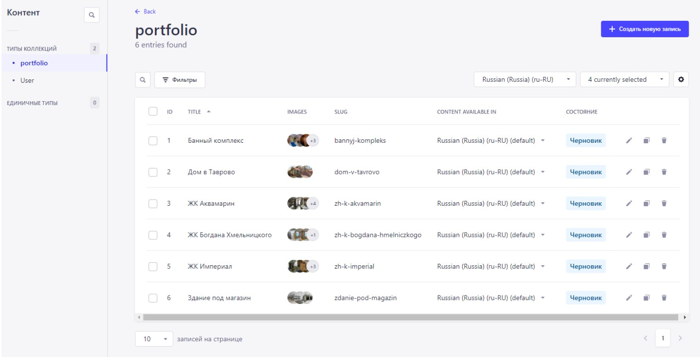

# 🚀 Начало работы со Страпи

Strapi поставляется с полнофункциональным [интерфейсом командной строки](https://docs.strapi.io/developer-docs/latest/developer-resources/cli/CLI.html) (CLI), который позволяет создавать шаблоны и управлять проектом за считанные секунды.


API Strap

### `develop`

Start your Strapi application with autoReload enabled. [Learn more](https://docs.strapi.io/developer-docs/latest/developer-resources/cli/CLI.html#strapi-develop)

```
npm run develop
# or
yarn develop
```

### `start`

Запустите приложение Strapi с включенной автоматической перезагрузкой. [Узнать больше](https://docs.strapi.io/developer-docs/latest/developer-resources/cli/CLI.html#strapi-start)

```
npm run start
# or
yarn start
```

### `build`

Создайте свою панель администратора. [Узнать больше](https://docs.strapi.io/developer-docs/latest/developer-resources/cli/CLI.html#strapi-build)

```
npm run build
# or
yarn build
```

## ⚙️ Развертывание

Strapi предлагает множество возможных вариантов развертывания для вашего проекта. Найдите подходящий вам в [разделе документации по развертыванию](https://docs.strapi.io/developer-docs/latest/setup-deployment-guides/deployment.html).

## 📚 Узнать больше

- [Ресурсный центр](https://strapi.io/resource-center) - Ресурсный центр Strapi.
- [Документация Strapi](https://docs.strapi.io) - официальная документация Strapi.
- [Туториал Strapi](https://strapi.io/tutorials) - список руководств, созданных основной командой и сообществом.
- [Блог Strapi](https://docs.strapi.io) - Official Strapi blog containing articles made by the Strapi team and the community.

## ✨ Сообщество

- [Discord](https://discord.strapi.io) - общайтесь с сообществом Strapi, включая основную команду.
- [Форум](https://forum.strapi.io/) - место, где можно обсуждать, задавать вопросы и находить ответы, показывать свой проект Strapi и получать отзывы или просто общаться с другими участниками сообщества.
